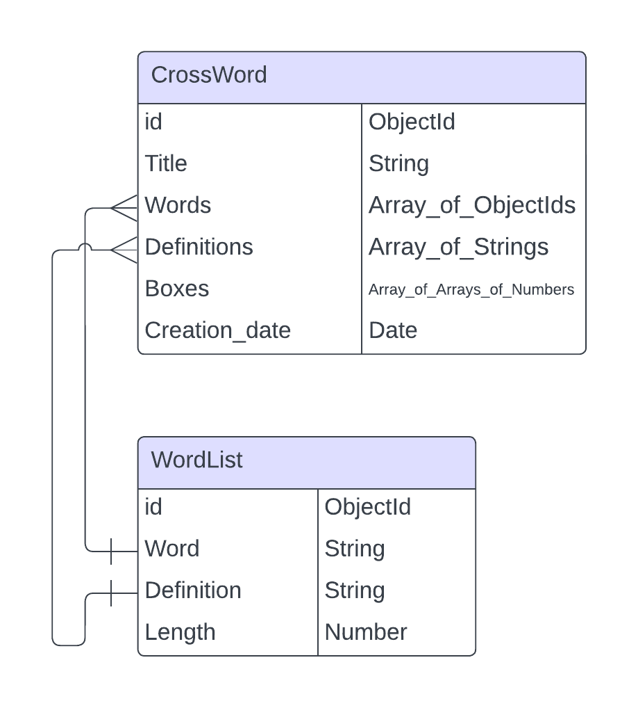

# Back-end
# Crossword Puzzle Generator Backend

This backend service, developed using Java with Spring Boot, aims to provide functionality for generating crossword puzzles dynamically. The process involves retrieving a random word from one API and fetching its definition from another API. The obtained word and its definition are then stored in a MongoDB database.

## Endpoints

### GET /random-word
Retrieve a random word from an external API.

#### Response:
- JSON object with the following information:
  - **id** (String): Unique identifier of the word.
  - **word** (String): The word itself.
  - **definition** (String): The definition of the word.
  - **length** (Number): Length of the word in characters.

### POST /crossword-puzzles
Generate a new crossword puzzle.

#### Request:
- JSON object with the following information:
  - **title** (String): Title of the crossword puzzle.
  - **words** (Array of Strings): List of words for the crossword puzzle.
  - **definitions** (Array of Strings): List of definitions corresponding to the words.
  - **boxes** (Number): Number of boxes in the crossword puzzle.
  - **creation_date** (String): Creation date of the crossword puzzle.

#### Response:
- JSON object with the information of the created crossword puzzle.

## Database Structure

### WordList Collection
- **id** (String): Unique identifier of the word.
- **word** (String): The word itself.
- **definition** (String): The definition of the word.
- **length** (Number): Length of the word in characters.

### CrossWord Collection
- **id** (String): Unique identifier of the crossword puzzle.
- **title** (String): Title of the crossword puzzle.
- **words** (Array of Strings): List of words used in the crossword puzzle.
- **definitions** (Array of Strings): List of definitions corresponding to the words.
- **boxes** (Number): Number of boxes in the crossword puzzle.
- **creation_date** (String): Creation date of the crossword puzzle.

## HTTP Status Codes
- **200 OK**: Successful request.
- **400 Bad Request**: Malformed request.
- **401 Unauthorized**: Not authorized.
- **404 Not Found**: Resource not found.
- **500 Internal Server Error**: Internal server error.

Database Design to use in mongoDB: 
